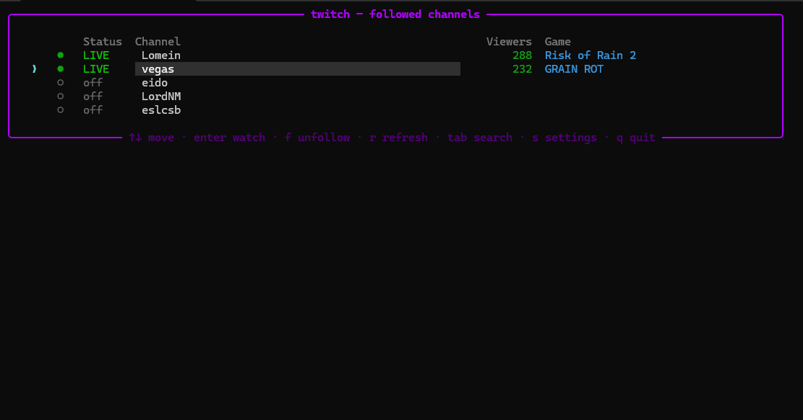
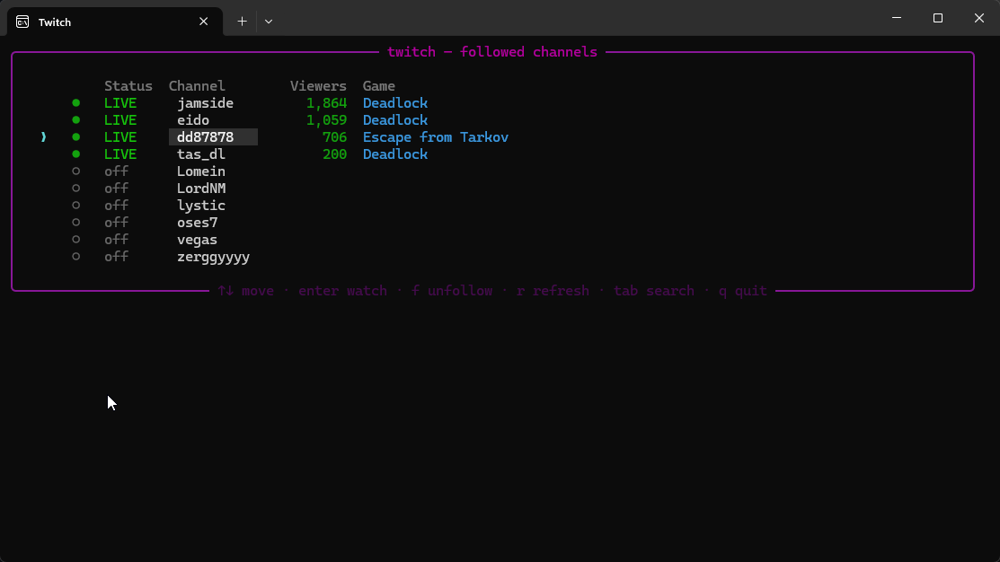
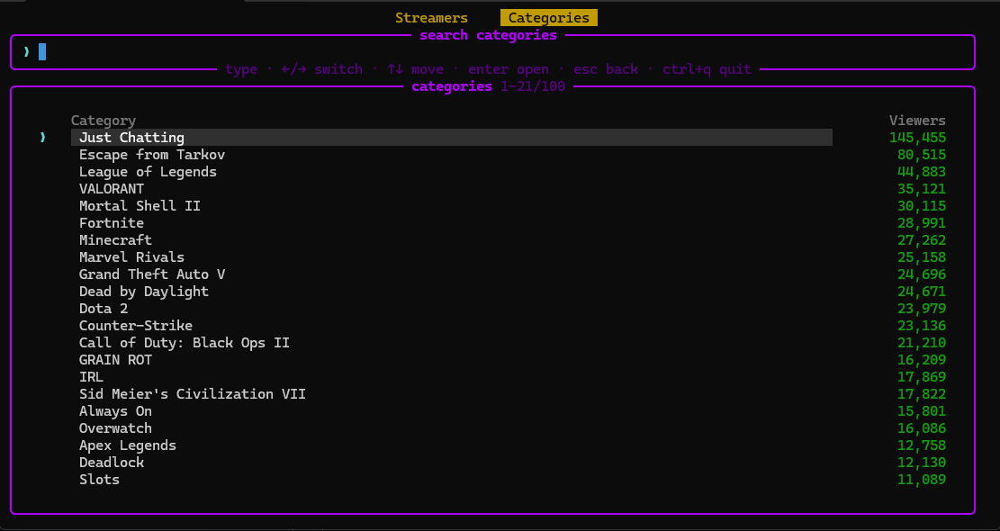

<p align="center">
  
</p>

<h1 align="center">twtui</h1>

<p align="center">
  <strong>A terminal UI for watching Twitch.</strong>
</p>

<p align="center">
  <a href="https://github.com/gmcky/twtui/stargazers"></a>
  <a href="https://github.com/gmcky/twtui/commits/main"></a>
  
  
</p>

<p align="center">
  <a href="#features">Features</a> •
  <a href="#install">Install</a> •
  <a href="#usage">Usage</a> •
  <a href="#keys">Keys</a> •
  <a href="#notes">Notes</a>
</p>

---

See which of your followed Twitch channels are live, search all of Twitch, browse
categories, and open any stream in your player without leaving the terminal.
Streams launch through [streamlink](https://streamlink.github.io/). No login, no
API key.



| Search | Categories |
|---|---|
|  |  |

## Features

- Followed-channel list with live status, viewer count and current game.
- Fuzzy search across all of Twitch (matches logins and display names, any language).
- Browse top categories and the top channels within one.
- Follow / unfollow from anywhere; the list is saved per user.
- Open a stream in your player with one key; a launch that dies right away is
  flagged `✗ failed` instead of pretending to be open.
- Quick presets (Balanced, Low latency, High quality, Data saver, Unstable
  connection) set a whole bundle of streamlink options in one pick; edit any of
  them and the preset shows as Custom.
- Deep streamlink control without knowing the flags: quality, low-latency, codecs,
  live edge, player path/args, retries, timeout, buffer size, segment threads,
  proxy, IPv4/IPv6 - all as plain settings.
- Watch VODs: type a `twitch.tv/videos/<id>`, a bare id, or `videos/<id>` in search
  and open the past broadcast with a fully seekable timeline.
- Record / DVR: write the live stream to a `.ts` while watching; `d` opens the
  growing file in a second player so you can seek backward. `--hls-live-restart`
  optionally starts nearer the beginning of the available window.
- Settings screen (saved to config.json), organized in sections: Quick setup,
  General, Streamlink, Network, Recording, Appearance (theme colors), Lists
  (auto-refresh, result counts), Hotkeys (rebindable), System (kill-on-exit,
  confirm-before-quit, startup cleanup, Windows run-on-startup).
- Hotkeys work on any keyboard layout and can be rebound.

## Install

Needs [streamlink](https://streamlink.github.io/) and a player (mpv or VLC) on your PATH.

```bash
git clone https://github.com/gmcky/twtui
cd twtui
pip install -e .
twtui
```

Or run it straight from a clone:

```bash
pip install rich requests psutil
python -m twtui.app
```

## Usage

- The app opens on your followed list. Add channels by following them from search
  (see keys below), or edit `channels.txt` in your config dir:
  - Windows: `%APPDATA%\twitch-tui\channels.txt`
  - Linux: `~/.config/twitch-tui/channels.txt`
  - macOS: `~/Library/Application Support/twitch-tui/channels.txt`
- `Enter` on a channel opens it in your player.
- To watch a past broadcast, open search (`Tab`) and type a VOD reference -
  `twitch.tv/videos/123456789`, `videos/123456789`, or just the numeric id - then
  `Enter`. VODs are fully seekable; live streams are not (Twitch only serves a short
  live window).
- To record while watching, turn on Recording in settings and set a folder. `d` on
  the followed list opens that recording in a second player with a seekable timeline.

## Keys

| Key | Action |
|-----|--------|
| `↑` `↓` | Move |
| `Enter` | Watch selected |
| `Tab` | Switch followed list ⇄ search |
| `←` `→` | Switch Streamers / Categories (in search) |
| `Ctrl+F` | Follow / unfollow (in search or a category) |
| `f` | Unfollow (in the followed list) |
| `r` | Refresh live status |
| `d` | Open the selected channel's recording in a second player (when recording) |
| `s` | Settings |
| `Ctrl+Q` | Quit (from anywhere) |
| `Esc` | Back / quit |

The single-key list hotkeys (`f` `r` `s` `q` and search `/`) are rebindable in the
settings screen.

## Notes

- Unofficial. It uses Twitch's public web GraphQL, not the official API, so it can
  break if Twitch changes things. Search returns ~10 results and lists load one
  page (row counts are configurable in settings, but Twitch caps search server
  side); deeper cursor paging needs a signed token and is not implemented.
- Not affiliated with Twitch.

## License

MIT
